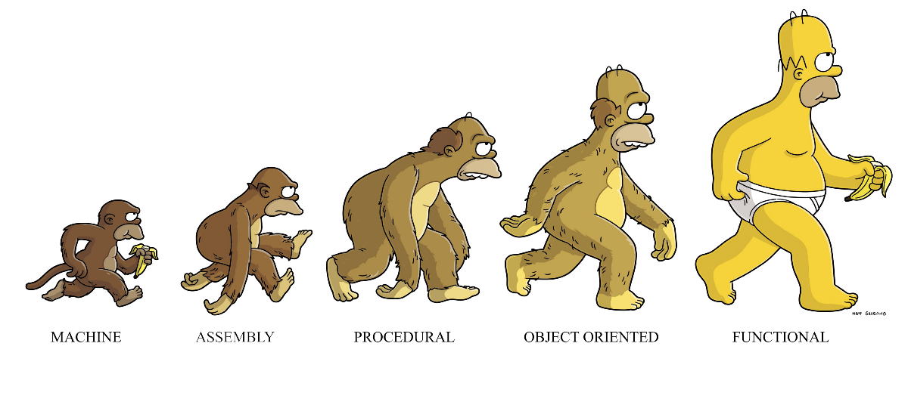

# Functional Java with Vavr

[source](https://shastri-shankar9.medium.com/functional-programming-in-scala-through-q-as-part-1-45802a72d62a)
## Functional Java
Historically Java supported only imperative approach of coding. Which means that a developer had to specify each step that the computer must take to deliver the goal. 
```java
List<String> destinationList = new ArrayList<>();
for (String value : sourceList) {
    if (value.contains("Hello")) {
        destinationList.add(value);
    }
}
```
## Java 8
Since 8th version, Java introduced more declarative features which allows Functional Programming. So instead of describing each step with state, you are able to pass only behaviour. The similar code you can write with Java 8 in this way:
```java
List<String> destinationList = sourceList.stream()
      .filter(word -> word.contains("Hello"))
      .collect(Collectors.toList());
```

### New features includes:
* Lambda
* Stream/primitive streams
* Optional
* Functional Interfaces (Supplier, Consumer, Predicate, UnaryOperator...  BiFunction etc.)
* Method references

However these features are not ideal and it could be delivered in better way. That's the reason why Vavr was invented (formerly called Javaslang). 

## Vavr

>Vavr is an object-functional language extension to Java 8, which aims to reduce the lines of code and increase code quality. It provides persistent collections, functional abstractions for error handling, concurrent programming, pattern matching and much more.

>Vavr is a new Guava!

[Check Git Repository](https://github.com/vavr-io/vavr)

### What is monad?


Monad is a wrapper type such as Optional or Stream. It puts value in some context and allows to perform operation. For example the result might be: wrapped value, null, exception or another failure.
There are three laws: left identity, right identity and associativity.

### Examples
Streams:
```java
// Stream API
Stream<String> javaStream = Stream.of(collection);
javaStream.forEach(item -> System.out.println("List items: " + item));
javaStream.forEach(item -> System.out.println("List items: " + item)); // throws IllegalStateException
Set<String> s1 = javaStream.collect(toCollection(LinkedHashSet::new));

// vs

Stream<String> vavrStream = Stream.of(collection);
vavrStream.forEach(item -> System.out.println("List items: " + item));
vavrStream.forEach(item -> System.out.println("List items: " + item)); // Streams implements Iterable!
Set<String> s2 = vavrStream.toLinkedSet();
```
Try:
```java
// before
String urlString = "";
try {
    URL url = new URL("https://github.com");
    urlString = url.toString();
} catch (Exception e) {
    e.printStackTrace();
}
// after
String url = Try.of(() -> new URL(badStringUrl))
                .map(uri -> uri.toString())
                .getOrElseThrow(() -> new RuntimeException("Url error!));
```
Functional Interfaces
```java
// before
BiFunction<String, Integer, Boolean> function2 = (text, integer) -> Integer.parseInt(text) == integer;
// after
Function2<String, Integer, Boolean> function = (text, integer) -> Integer.parseInt(text) == integer;
```
Either:
```java
Either<String, Integer> processExamMark(int score) {
    if (score > 70) {
        return Either.right(score);
    } else {
        return Either.left("Exam not passed!");
    }
}
```
Pattern Matching:
```java
 int number = 3;
 String numberAsText = Match(number).of(
         Case($(is(1)), "one"),
         Case($(is(2)), "two"),
         Case($(is(3)), "three"),
         Case($(), "?"));
```
Touple:
```
int amount = 1;
double price = 2399.99;
String product = "Bike";
Tuple3<String, Integer, Double> order = Tuple.of(product, amount, price);
```

## Project goals
This is a simple project to check Vavr features. 